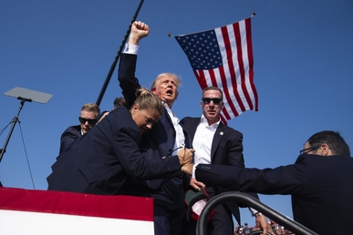
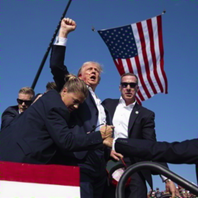
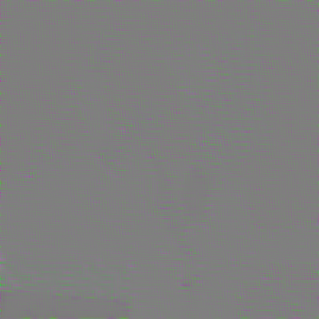

## StegaStamp-pytorch

A PyTorch reimplementation of StegaStamp. It provides training and inference scripts.

### News
- We have released the official version! Enjoy! The current code implements the basic functionality of StegaStamp. However, some features from the TensorFlow implementation, such as geometric augmentation, have not been adopted. We found that the basic implementation can already achieve the goal of hiding information with good image quality.

### Environment (pixi)

1) After installing pixi, run at the project root:

```bash
pixi install
```

2) Helpful entrypoints:

```bash
pixi run train
pixi run encode
pixi run decode
```

### Training

```bash
bash scripts/train.sh
```

Outputs: `checkpoints/exp_name/*.pt` and `saved_models/exp_name/stegastamp.pt`

### Inference (generate hidden image and residual)

```bash
python -m stegastamp.encode_image --model saved_models/exp_name/stegastamp.pt \
  --images_dir ./examples \
  --save_dir ./outputs \
  --secret Stega!! \
  --height 400 --width 400
```

### Decode

```bash
python -m stegastamp.decode_image --model saved_models/exp_name/stegastamp.pt \
  --image ./outputs/xxx_hidden.png \
  --height 400 --width 400 --secret_size 20
```

### Differences from the original TF implementation
- Removed the original TensorFlow pipeline's affine and inverse transforms around the encoder/decoder. This weakens geometric alignment cues and can make optimization harder (slower convergence, more sensitive to learning rate/regularization).


### Example

Here's an example of encoding and decoding an image with a secret message.

**Original Image:**



**1. Encode the image with a secret**

```bash
pixi run python -m stegastamp.encode_image \\
  --model /workspace/StegaStamp-pytorch/checkpoints/20250828_194452_stegastamp_imagenet_align_to_backdoorbox_version3_photometric/best.pth \\
  --image /workspace/StegaStamp-pytorch/asset/Shooting_of_Donald_Trump.jpg \\
  --save_dir /workspace/StegaStamp-pytorch/outputs/demo \\
  --secret "Stega!" \\
  --height 400 --width 400
```

This will generate two images in the `outputs/demo` directory:

*   `Shooting_of_Donald_Trump_hidden.png`: The image with the secret embedded.
*   `Shooting_of_Donald_Trump_residual.png`: The difference between the original and the hidden image.

**Encoded Image:**



**Residual:**



**2. Decode the secret from the image**

```bash
pixi run python -m stegastamp.decode_image \\
  --model /workspace/StegaStamp-pytorch/checkpoints/20250828_194452_stegastamp_imagenet_align_to_backdoorbox_version3_photometric/best.pth \\
  --image /workspace/StegaStamp-pytorch/asset/Shooting_of_Donald_Trump_hidden.png \\
  --height 400 --width 400 --secret_size 100
```

**Decoded Secret:**

```
Stega!
```

### Acknowledgements

We would like to thank the following projects for their contributions:

- **StegaStamp**: The original TensorFlow implementation by Matthew Tancik et al. available at [https://github.com/tancik/StegaStamp](https://github.com/tancik/StegaStamp).
- **BackdoorBox**: An open-source Python toolbox for backdoor attacks and defenses developed by Yiming Li et al. available at [https://github.com/THUYimingLi/BackdoorBox](https://github.com/THUYimingLi/BackdoorBox).

### Citation

If you use this project in your research, please cite:

```
@misc{chen2024stegastamppytorch,
  author = {Tuo Chen},
  title = {StegaStamp-PyTorch},
  year = {2024},
  publisher = {GitHub},
  journal = {GitHub repository},
  howpublished = {\\url{https://github.com/tuo-chen/StegaStamp-pytorch}}
}
```


